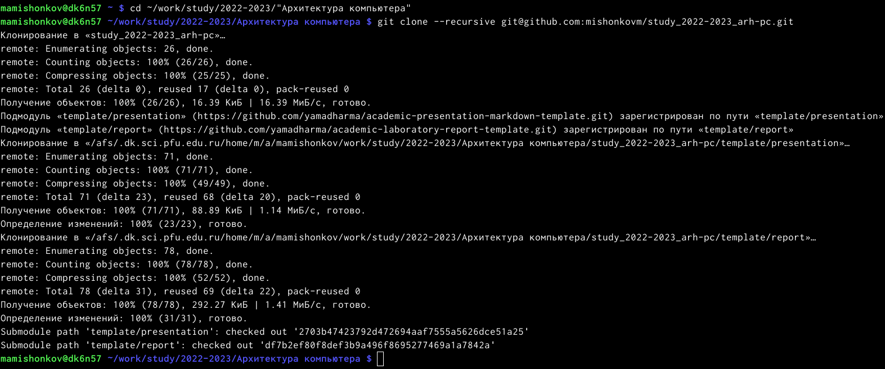

---
## Front matter
title: "Отчёт по лабораторной работе №3"
subtitle: "*дисциплина: Архитектура компьютера*"
author: "Максим Александрович Мишонков"

## Generic otions
lang: ru-RU
toc-title: "Содержание"

## Bibliography
bibliography: bib/cite.bib
csl: pandoc/csl/gost-r-7-0-5-2008-numeric.csl

## Pdf output format
toc: true # Table of contents
toc-depth: 2
lof: true # List of figures
lot: true # List of tables
fontsize: 12pt
linestretch: 1.5
papersize: a4
documentclass: scrreprt
## I18n polyglossia
polyglossia-lang:
  name: russian
  options:
	- spelling=modern
	- babelshorthands=true
polyglossia-otherlangs:
  name: english
## I18n babel
babel-lang: russian
babel-otherlangs: english
## Fonts
mainfont: PT Serif
romanfont: PT Serif
sansfont: PT Sans
monofont: PT Mono
mainfontoptions: Ligatures=TeX
romanfontoptions: Ligatures=TeX
sansfontoptions: Ligatures=TeX,Scale=MatchLowercase
monofontoptions: Scale=MatchLowercase,Scale=0.9
## Biblatex
biblatex: true
biblio-style: "gost-numeric"
biblatexoptions:
  - parentracker=true
  - backend=biber
  - hyperref=auto
  - language=auto
  - autolang=other*
  - citestyle=gost-numeric
## Pandoc-crossref LaTeX customization
figureTitle: "Рис."
tableTitle: "Таблица"
listingTitle: "Листинг"
lofTitle: "Список иллюстраций"
lotTitle: "Список таблиц"
lolTitle: "Листинги"
## Misc options
indent: true
header-includes:
  - \usepackage{indentfirst}
  - \usepackage{float} # keep figures where there are in the text
  - \floatplacement{figure}{H} # keep figures where there are in the text
---

# Цель работы 

Целью данной лабораторной работы является изучение идеологии и применение средств системы контроля версий Git, а также приобретение практических навыков работы с ней.

# Задание

Изучить идеологию и применение средств системы контроля версий Git, оформить отчет по данной лабораторной работе.

# Теоретическое введение

Системы контроля версий применяются при работе нескольких человек над одним проектом. основное дерево хранится в локальном или удалённом репозитории, к которому настроен доступ для участников проекта. При внесении изменений в содержание проекта система контрорля версий позворляет их фиксировать, совмещать изменения.

Репозиторий - это место, где хранятся и поддерживаются какие-либо данные.

Система контроля версий Git - это набор программ командной строки, доступ к которым можно получить из терминала при помощи ввода команды git с различными опциями.

# Выполнение лабораторной работы

1. Создал учётную запись на сайте github.com и заполнил основные данные. (рис. [-@fig:001], рис. [-@fig:002])

{ #fig:001 width=70% }

{ #fig:002 width=70% }

2. Сделал предварительную конфигурацию git. Для этого открыл терминал и ввёл проилюстрированные на изображениях команды. (рис. [-@fig:003], [-@fig:004], [-@fig:005], [-@fig:006], [-@fig:007])

{ #fig:003 width=70% }

{ #fig:004 width=70% }

{ #fig:005 width=70% }

{ #fig:006 width=70% }

{ #fig:007 width=70% }

3. Для последующей идентификации пользователя на сервере репозиториев я сгенерировал пару ключей, перейдя в каталог ~/.ssh.(рис. [-@fig:008])

{ #fig:008 width=70% }

4. Скопировал открытый ключ из локальной консоли в буфер обмена по иллюстрированной на изображении команде.(рис. [-@fig:009])

{ #fig:009 width=70% }

5. Загрузил сгенерированный открытый ключ. Для этого я на сайте github.com перешёл в меню "setting", выбрал в боковом меню "SHH and GPG keys" и нажал кнопку "New SHH key". Указал имя ключа и вставил ключ в поле.(рис. [-@fig:010], рис. [-@fig:011])

{ #fig:010 width=70% }

{ #fig:011 width=70% }

6. Создал рабочее пространство с изображённой на изоюражении иерархией.(рис. [-@fig:012])

{ #fig:012 width=70% }

7. Создал репозиторий на основе шаблона.(рис. [-@fig:013], рис. [-@fig:014])

{ #fig:013 width=70% }

{ #fig:014 width=70% }

8. Открыл терминал и перешёл в каталог курса, клонировал созданный репозиторий на локальную машину, предварительно скопировав ссылку для его клонирования.(рис. [-@fig:015], рис. [-@fig:016])

{ #fig:015 width=70% }

{ #fig:016 width=70% }

9. Перешёл в каталог с репозиторием и посмотрел его содержимое.(рис. [-@fig:017])

{ #fig:017 width=70% }

10. Удалил файл package.json и создал файл COURSE, содержащий текст "arch-pc".(рис. [-@fig:018])

{ #fig:018 width=70% }

11. Воспользовался командой make, чтобы выполнить команды из Makefile. (рис. [-@fig:019])

{ #fig:019 width=70% }

12. Добавил изменения командой git add, закоммитил их и отправил на сервер.(рис. [-@fig:020], рис. [-@fig:021], рис. [-@fig:022], рис. [-@fig:023], рис. [-@fig:024])

{ #fig:020 width=70% }

{ #fig:021 width=70% }

{ #fig:022 width=70% }

{ #fig:023 width=70% }

{ #fig:024 width=70% }

13. Запушил изменения.(рис. [-@fig:025])

{ #fig:025 width=70% }

14. Посмотрел список коммитов в моём профиле на сайте github.com.(рис. [-@fig:026], рис. [-@fig:027])

{ #fig:026 width=70% }

{ #fig:027 width=70% }

**Самостоятельная работа**

1. Создал отчёт по выполнению лабораторной работы в соответствующем каталоге рабочего пространства.(рис. [-@fig:028], рис. [-@fig:029])

{ #fig:028 width=70% }

{ #fig:029 width=70% }

2. Загрузил на Linux файлы с предыдущими лабораторными работами.(рис. [-@fig:030])

{ #fig:030 width=70% }

3. Скопировал отчёты по выполнению предыдущих лабораторных работ в соответствующие каталоги созданного рабочего пространства, а затем загрузил эти файлы на github.(рис. [-@fig:031])

{ #fig:031 width=70% }

4. Проверил загруженные на github файлы.(рис. [-@fig:032], рис. [-@fig:033])

{ #fig:032 width=70% }

{ #fig:033 width=70% }

# Выводы

В ходе выполнения данной лабораторной работы я познакомился с системой контроля версий Git, создал репозиторий на основе шаблона на сайте github и внёс в него изменения, создал рабочее пространство для следующих лабораторных работ. 

# Список литературы{.unnumbered}

::: {#refs}
:::
