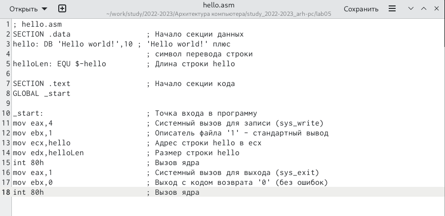

---
## Front matter
title: "Отчёт по лабораторной работе №5"
subtitle: "*Дисциплина: Архитектура компьютера*"
author: "Максим Александрович Мишонков"

## Generic otions
lang: ru-RU
toc-title: "Содержание"

## Bibliography
bibliography: bib/cite.bib
csl: pandoc/csl/gost-r-7-0-5-2008-numeric.csl

## Pdf output format
toc: true # Table of contents
toc-depth: 2
lof: true # List of figures
fontsize: 12pt
linestretch: 1.5
papersize: a4
documentclass: scrreprt
## I18n polyglossia
polyglossia-lang:
  name: russian
  options:
	- spelling=modern
	- babelshorthands=true
polyglossia-otherlangs:
  name: english
## I18n babel
babel-lang: russian
babel-otherlangs: english
## Fonts
mainfont: PT Serif
romanfont: PT Serif
sansfont: PT Sans
monofont: PT Mono
mainfontoptions: Ligatures=TeX
romanfontoptions: Ligatures=TeX
sansfontoptions: Ligatures=TeX,Scale=MatchLowercase
monofontoptions: Scale=MatchLowercase,Scale=0.9
## Biblatex
biblatex: true
biblio-style: "gost-numeric"
biblatexoptions:
  - parentracker=true
  - backend=biber
  - hyperref=auto
  - language=auto
  - autolang=other*
  - citestyle=gost-numeric
## Pandoc-crossref LaTeX customization
figureTitle: "Рис."
tableTitle: "Таблица"
listingTitle: "Листинг"
lofTitle: "Список иллюстраций"
lolTitle: "Листинги"
## Misc options
indent: true
header-includes:
  - \usepackage{indentfirst}
  - \usepackage{float} # keep figures where there are in the text
  - \floatplacement{figure}{H} # keep figures where there are in the text
---

# Цель работы

Целью данный лабораторной работы является освоение компиляции и сборки программ, написанных на ассемблере NASM.

# Задание

Освоить компиляцию и сборку программ, написанных на ассемблере NASM, закрепить навыки работы с текстовым редактором Markdown.

# Теоретическое введение

**Язык ассемблера** - машинно-ориентированный язык низкого уровня. Можно считать, что он больше любых других языков приближен к архитектуре ЭВМ и её аппаратным возможностям, что позволяет получить к ним более полный доступ, нежели в языках высокого уровня.

**NASM** - это открытый проект ассемблера, версии которого доступны под различные операционные системы и который позволяет получать объектные файлы для этих систем.

# Выполнение лабораторной работы

1. Создал каталог lab05 и перешёл в него. (рис. [-@fig:001])

{ #fig:001 width=70% }

2. Создал файл hello.asm и открыл его при помощи gedit. (рис. [-@fig:002], [-@fig:003] )

{ #fig:002 width=70% }

{ #fig:003 width=70% }

3. Компилировал текст с помощью транслятора NASM и компилировал файл hello.asm в obj.o. (рис. [-@fig:004])

{ #fig:004 width=70% }

4. Ввёл команды для обработки компановщиком файла hello.o и obj.o (рис. [-@fig:005])

{ #fig:005 width=70% }

5. Запустил на выполнение созданный выполняемый файл, находящийся в текущем каталоге. (рис. [-@fig:006])

{ #fig:006 width=70% }

**Самостоятельная работы**

1. Создал в нужном каталоге при помощи команды cp копию файла hello.asm с именем lab05.asm. (рис. [-@fig:007])

{ #fig:007 width=70% }

2. При помощи текстового редактора gedit внёс изменения в текст программы в файле lab05.asm так, чтобы вместо Hello world! на экран выводилась строка с моим именем и фамилией. (рис. [-@fig:008]) 

{ #fig:008 width=70% }

3. Оттранслировал полученный текст программы lab05.asm в объектный файл, выполнил компановку файла и запустил получившийся исполняемый файл. (рис. [-@fig:009])

{ #fig:009 width=70% }

4. Скопировал файлы hello.asm и lab05.asm в локальный репозиторий. (рис. [-@fig:010])

{ #fig:010 width=70% }

5. Загрузил файлы на Github. (рис. [-@fig:011])

{ #fig:011 width=70% }

# Выводы

В ходе выполнения данной лабораторной работы я закрепил знания и умения работы с Markdown, а также освоил процедуры компиляции и сборки программы, написанные на ассемблере NASM.

