---
## Front matter
title: "Отчёт по лабораторной работе №8"
subtitle: "*дисциплина: Архитектура компьютера*"
author: "Максим Александрович Мишонков"

## Generic otions
lang: ru-RU
toc-title: "Содержание"

## Bibliography
bibliography: bib/cite.bib
csl: pandoc/csl/gost-r-7-0-5-2008-numeric.csl

## Pdf output format
toc: true # Table of contents
toc-depth: 2
lof: true # List of figures
fontsize: 12pt
linestretch: 1.5
papersize: a4
documentclass: scrreprt
## I18n polyglossia
polyglossia-lang:
  name: russian
  options:
	- spelling=modern
	- babelshorthands=true
polyglossia-otherlangs:
  name: english
## I18n babel
babel-lang: russian
babel-otherlangs: english
## Fonts
mainfont: PT Serif
romanfont: PT Serif
sansfont: PT Sans
monofont: PT Mono
mainfontoptions: Ligatures=TeX
romanfontoptions: Ligatures=TeX
sansfontoptions: Ligatures=TeX,Scale=MatchLowercase
monofontoptions: Scale=MatchLowercase,Scale=0.9
## Biblatex
biblatex: true
biblio-style: "gost-numeric"
biblatexoptions:
  - parentracker=true
  - backend=biber
  - hyperref=auto
  - language=auto
  - autolang=other*
  - citestyle=gost-numeric
## Pandoc-crossref LaTeX customization
figureTitle: "Рис."
tableTitle: "Таблица"
listingTitle: "Листинг"
lofTitle: "Список иллюстраций"
lolTitle: "Листинги"
## Misc options
indent: true
header-includes:
  - \usepackage{indentfirst}
  - \usepackage{float} # keep figures where there are in the text
  - \floatplacement{figure}{H} # keep figures where there are in the text
---

# Цель работы

Целью данной лабораторной работы является изучение команд условного и безусловного переходов, приобретение навыков написания программ с использованием переходов, знакомство с назначением и структурой файла листинга.

# Задание

Изучить команды условного и безусловного переходов, приобрести навыки написания программ с использованием переходов, познакомиться с назначением и структурой файла листинга. 

# Теоретическое введение

Для реализации ветвлений в ассемблере используются команды передачи управления или команды перехода. Можно выделить 2 типа переходов:

**Условный переход** – это выполнение перехода в определенную точку программы в зависимости от проверки условия.

**Безусловный переход** – это выполнение передачи управления в определенную точку программы без каких-либо условий.

# Выполнение лабораторной работы

1. Создал каталог для программ лабораторной работы №8, перешёл в него и создал файл lab8-1.asm. (рис. [-@fig:001])

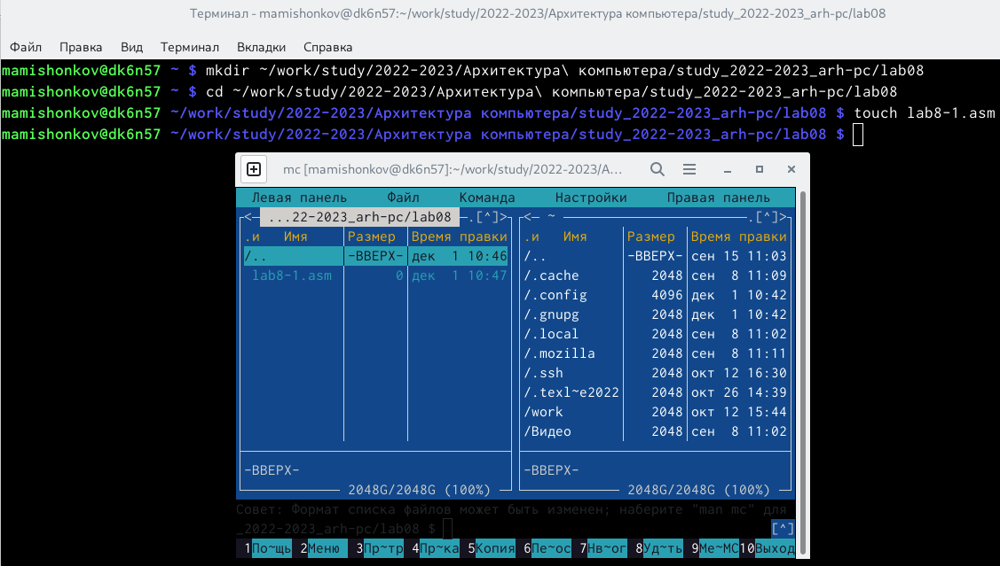{ #fig:001 width=70% }

2. Рассмотрел пример программы с использованием инструкции jump, ввёл в файл lab8-1.asm текст программы из листинга. (рис. [-@fig:002])

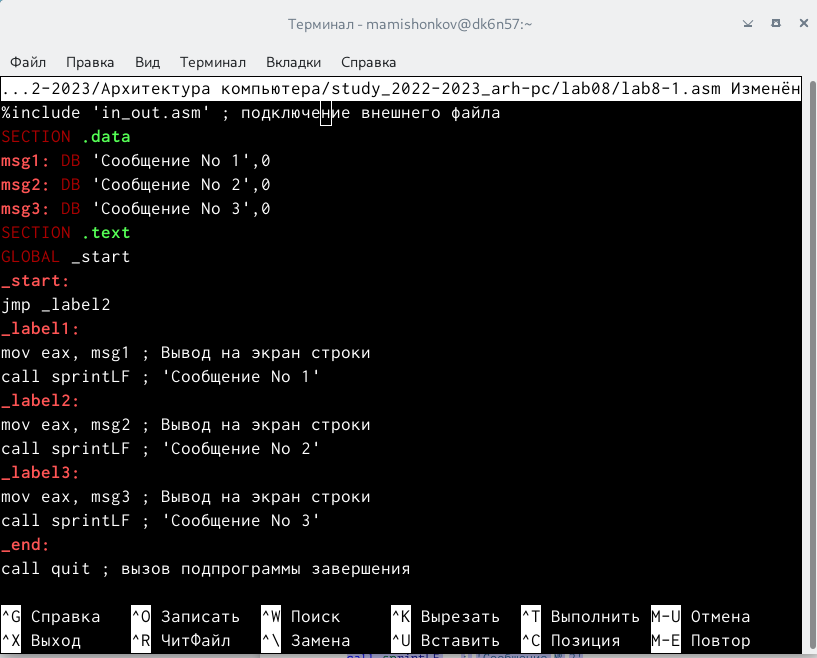{ #fig:002 width=70% }

3. Создал исполняемый файл и проверил его работу. (рис. [-@fig:003])

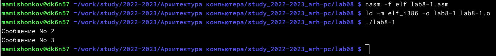{ #fig:003 width=70% }

4. Изменил текст программы таким образом, чтобы программа выводила сначала 'Сообщение №2', потом 'Сообщение №1'. Для этого в текст программы после вывода сообщения №2 добавил инструкцию jmp с меткой _label1, а после вывода сообщения №1 добавил инструкцию jmp с меткой _end. (рис. [-@fig:004])

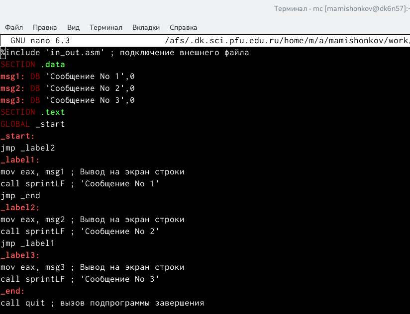{ #fig:004 width=70% }

5. Создал исполняемый файл и проверил его работу. (рис. [-@fig:005])

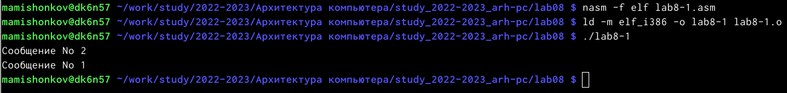{ #fig:005 width=70% }

6. Изменил текст программы, изменив инструкции jmp, чтобы вывод программы был следующим: (рис. [-@fig:006], [-@fig:007] )

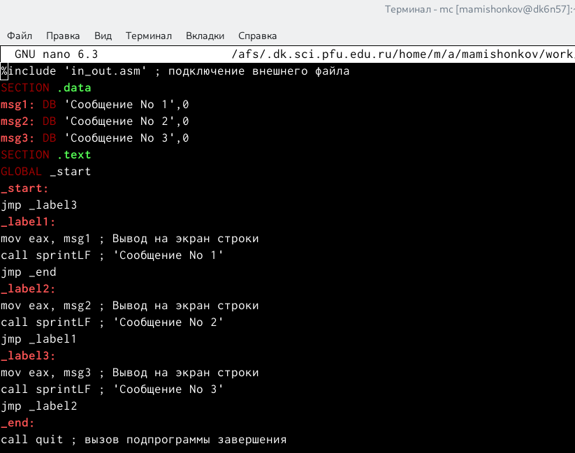{ #fig:006 width=70% }

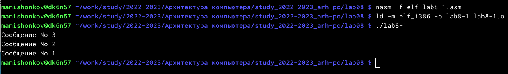{ #fig:007 width=70% }

7. Создал в каталоге lab08 файл lab8-2.asm, ввёл текст программы из листинга, которая определяет и выводит на экран наибольшую из 3 целочисленных переменных: A,B и C. (рис. [-@fig:008], [-@fig:009], [-@fig:010])

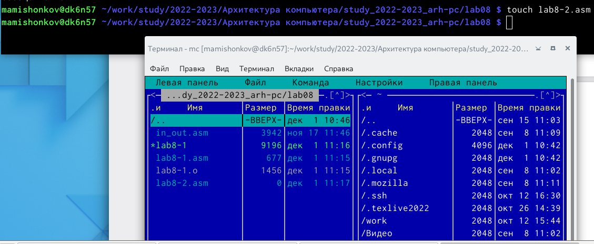{ #fig:008 width=70% }

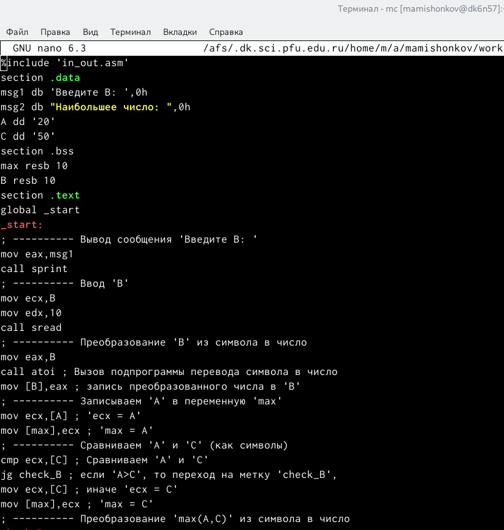{ #fig:009 width=70% }

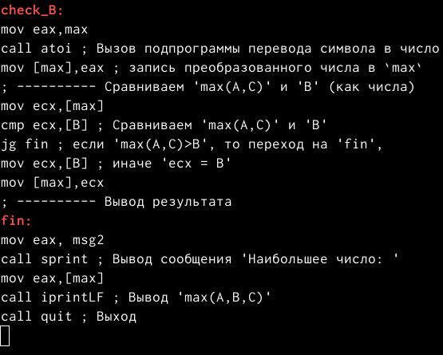{ #fig:010 width=70% }

8. Создал исполняемый файл и проверил его работу. (рис. [-@fig:011])

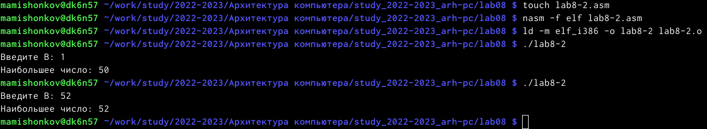{ #fig:011 width=70% }

9. Создал файл листинга для программы из файла lab8-2.asm, указав ключ -l и задав имя файла листинга в командной строке, открыл этот файл при помощи редактора mcedit. (рис. [-@fig:012], [-@fig:013])

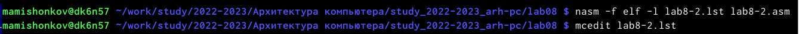{ #fig:012 width=70% }

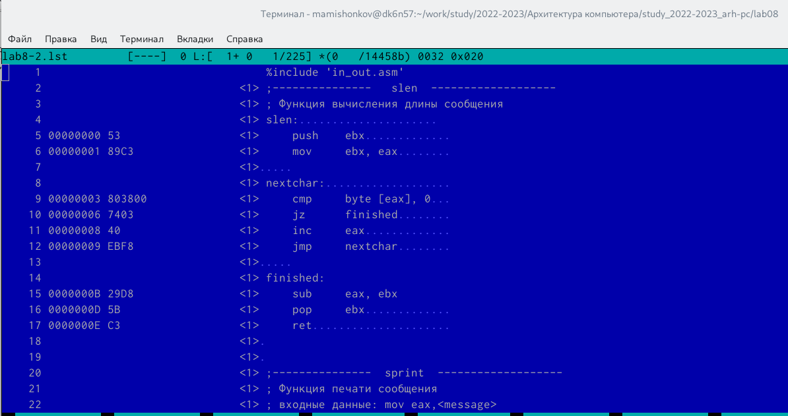{ #fig:013 width=70% }

10. Данная строка находится на 21 месте, её адрес - 00000101, машинный код - B8[0A000000], а mov eax,B - исходный текст программы, который означает, что мы в регистр eax вносим значение переменой B. (рис. [-@fig:014])

{ #fig:014 width=70% }

11. Данная строка находится на 35 месте, её адрес - 00000130, машинный код - E867FFFFFF, а call atoi - исходный текст программы, который означает, что символ, лежащий в строке выше, переводится в число. (рис. [-@fig:015])

{ #fig:015 width=70% }

12. Данная строка находится на 38 месте, её адрес - 0000013A, машинный код - 8B0D[00000000], а mov ecx,[max] - исходный текст программы, означающий, что число, хравнившееся в переменной max, записывается в регистр ecx. (рис. [-@fig:016])

{ #fig:016 width=70% }

13. Удалил один из операндов в файле с программой lab8-2.asm. (рис. [-@fig:017])

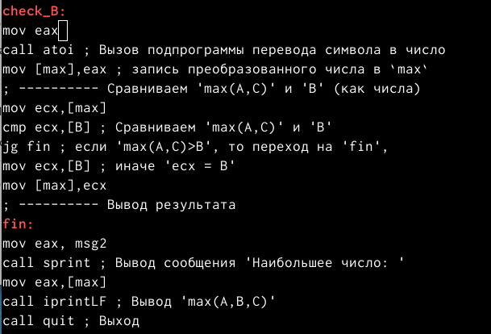{ #fig:017 width=70% }

14. Выполнил трансляцию с получением файла листинга, программа выдала ошибку, как и должно быть, потому что один из операндов был удалён. В файле листинга изображается, где именно ошибка и с чем она связана. (рис. [-@fig:018], [-@fig:019])

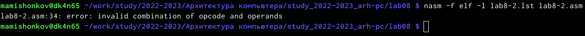{ #fig:018 width=70% }

{ #fig:019 width=70% }

**Самостоятельная работа**

1. Написал программу нахождения наименьшей из 3 целочисленных переменных, соответствующих варианту 14. (рис. [-@fig:020], [-@fig:021])

{ #fig:020 width=70% }

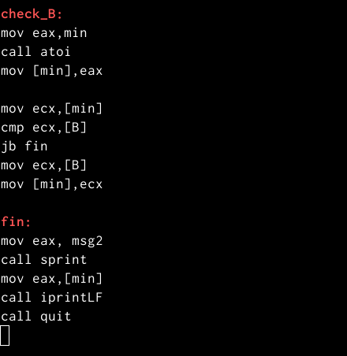{ #fig:021 width=70% }

2. Создал исполняемый файл и проверил его работу. (рис. [-@fig:022])

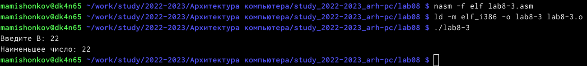{ #fig:022 width=70% }

3. Написал программу, которая для введённых с клавиатуры значений x и a вычисляет значение функции, соответствующей варианту 14, и выводит результат вычислений. (рис. [-@fig:023], [-@fig:024])

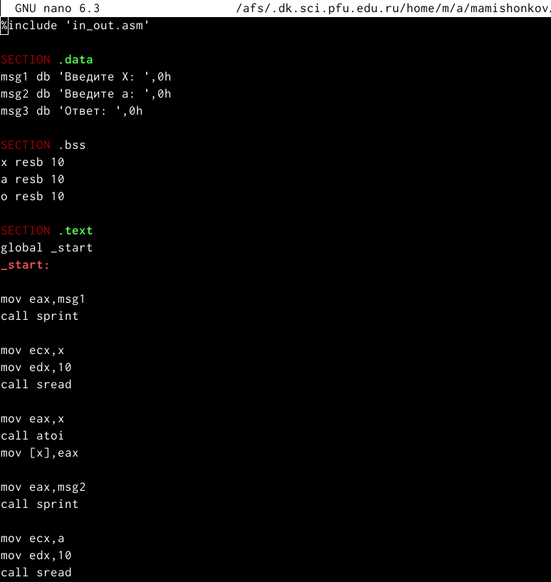{ #fig:023 width=70% }

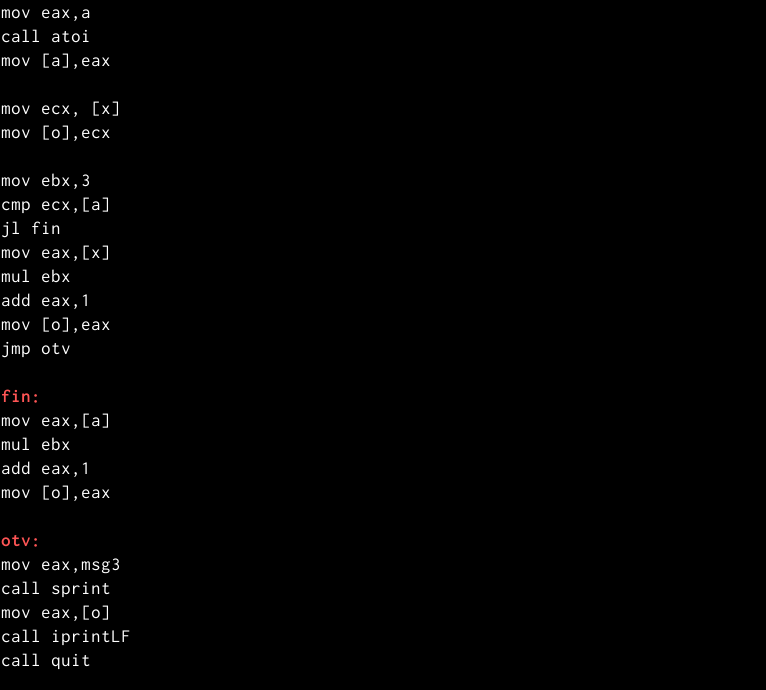{ #fig:024 width=70% }

4. Создал исполняемый файл и проверил его работу. (рис. [-@fig:025])

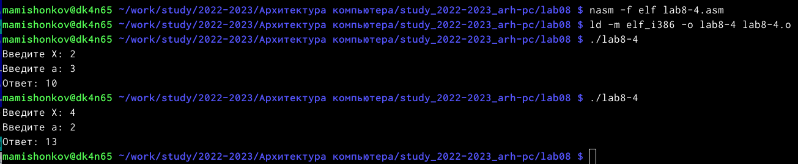{ #fig:025 width=70% }

# Выводы

В ходе выполнения данной лабораторной работы я изучил команды условного и безусловного переходов, приобрёл навыки написания программ с использованием переходов, познакомился с назначением и структурой файла листинга.

